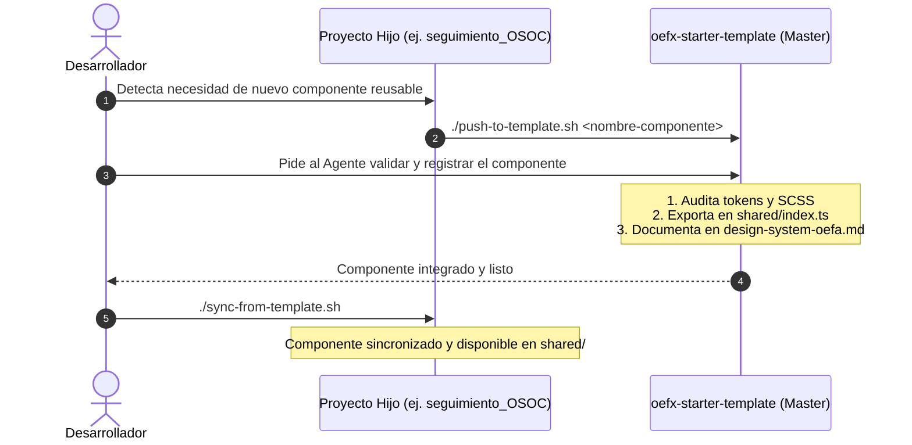

# Guía de Coordinación: Sistema de Diseño y Componentes Reutilizables

Este documento detalla el flujo de trabajo para crear, validar y sincronizar componentes entre los proyectos locales de OEFA, teniendo como fuente de la verdad (Master) a **`oefx-starter-template`**.

---

## 🏗️ Roles de los Proyectos

| Proyecto | Rol | Función |
| :--- | :--- | :--- |
| **`oefx-starter-template`** | **Master (Fuente de verdad)** | Almacena y cataloga los componentes compartidos, tokens y estilos oficiales. |
| **`seguimiento_OSOC`** | **Consumidor (Hijo)** | Consume componentes vía sync y promueve nuevos componentes hacia el master. |
| **`proyecto-demo-oefx`** | **Consumidor (Hijo)** | Consume componentes vía sync y promueve nuevos componentes hacia el master. |

---

## 🔄 Flujo de Trabajo: Nuevo Componente



---

## 📋 Pasos y Comandos

### Paso 1: En el proyecto hijo (ej. `seguimiento_OSOC`)

Si se creó o modificó un componente localmente en `frontend/src/app/shared/components/<nombre>`:

```bash
# 1. Posicionarse en la raíz del proyecto hijo
cd /Users/jalvareza/Desktop/labOefa/seguimiento_OSOC

# 2. Promover el componente hacia el master
./push-to-template.sh <nombre-componente>
```
*Ejemplo:*
```bash
./push-to-template.sh date-picker
```

---

### Paso 2: En el proyecto master (`oefx-starter-template`)

Pedirle al Agente en `oefx-starter-template`:

> *"He promovido el componente `<nombre-componente>`. Audita sus tokens y estilos para que cumplan con el sistema de diseño OEFA, expórtalo en `src/app/shared/index.ts` y documéntalo en `design-system/design-system-oefa.md`."*

El agente realizará:
1. Verificación de uso de tokens CSS (`--oefa-*`) y utilidades.
2. Exportación de clase y tipos en [src/app/shared/index.ts](file:///Users/jalvareza/Desktop/labOefa/oefx-starter-template/src/app/shared/index.ts).
3. Documentación de inputs/outputs en [design-system/design-system-oefa.md](file:///Users/jalvareza/Desktop/labOefa/oefx-starter-template/design-system/design-system-oefa.md).
4. Opcional: demo en `src/app/views/design-system/`.

---

### Paso 3: Sincronizar en los proyectos consumidores

Una vez integrado en el master, cualquier proyecto hijo puede recibir la versión oficial ejecutando:

#### En `seguimiento_OSOC`:
```bash
cd /Users/jalvareza/Desktop/labOefa/seguimiento_OSOC
./sync-from-template.sh
```

#### En `proyecto-demo-oefx`:
```bash
cd /Users/jalvareza/Desktop/labOefa/proyecto-demo-oefx
./sync-from-template.sh
```

---

## 🛠️ Resumen de Scripts Disponibles

| Script | Ubicación | Qué hace |
| :--- | :--- | :--- |
| **`push-to-template.sh <nombre>`** | Proyecto Hijo | Copia la carpeta del componente hacia `oefx-starter-template`. |
| **`sync-from-template.sh`** | Proyecto Hijo | Jala `shared/`, `design-system/`, `styles.scss` y vistas demo desde el master. |
