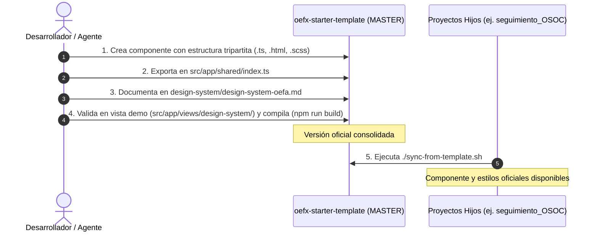
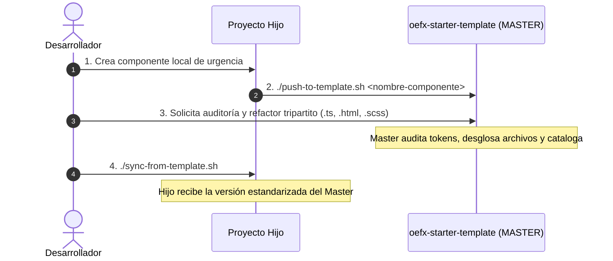

# Guía de Coordinación: Sistema de Diseño y Componentes Reutilizables

Este documento establece el flujo de trabajo para la creación, mantenimiento y sincronización de componentes y estilos en el ecosistema OEFA, teniendo a **`oefx-starter-template` como MASTER absoluto y única fuente de la verdad**.

---

## 🏗️ Roles del Ecosistema

| Proyecto | Rol | Función Principal |
| :--- | :--- | :--- |
| **`oefx-starter-template`** | **MASTER (Fuente de la verdad)** | **Cuna y catálogo del Design System:** Aquí se crean, auditan, desglosan y prueban todos los componentes, tokens (`design-tokens.json`), estilos globales (`styles.scss`) y vistas demo. |
| **`seguimiento_OSOC`** | **Consumidor (Hijo)** | Consume componentes, tokens y estilos desde el Master vía `./sync-from-template.sh`. |
| **`proyecto-demo-oefx`** | **Consumidor (Hijo)** | Consume componentes, tokens y estilos desde el Master vía `./sync-from-template.sh`. |

---

## 📐 Estructura Tripartita Obligatoria (Design System Standard)

Todo componente creado o mantenido en `src/app/shared/components/<nombre>/` debe respetar estrictamente la estructura coordinada en [SKILL.md](file:///Users/jalvareza/Desktop/labOefa/oefx-starter-template/.agents/skills/oefa-design-system/SKILL.md):

```
src/app/shared/components/<nombre>/
├── <nombre>.component.ts          # Lógica pura: @Input, @Output, signals, inyecciones
├── <nombre>.component.html        # Template semántico con WAI-ARIA y @if/@for
├── <nombre>.component.scss        # Estilos encapsulados con var(--oefa-*), NUNCA .css
└── <nombre>.models.ts             # (Opcional) Interfaces y tipos si superan ~30 líneas
```

---

## 🔄 Flujo Primario: Creación en el Master (Master-First — Recomendado)

Los componentes y estilos nacen directamente en el Master para garantizar calidad, accesibilidad y cohesión visual antes de distribuirse a los aplicativos de negocio.


```mermaid
sequenceDiagram
    autonumber
    actor Dev as Desarrollador / Agente
    participant Master as oefx-starter-template (MASTER)
    participant Hijo as Proyectos Hijos (ej. seguimiento_OSOC)

    Dev->>Master: 1. Crea componente con estructura tripartita (.ts, .html, .scss)
    Dev->>Master: 2. Exporta en src/app/shared/index.ts
    Dev->>Master: 3. Documenta en design-system/design-system-oefa.md
    Dev->>Master: 4. Valida en vista demo (src/app/views/design-system/) y compila (npm run build)
    Note over Master: Versión oficial consolidada
    Hijo->>Master: 5. Ejecuta ./sync-from-template.sh
    Note over Hijo: Componente y estilos oficiales disponibles
```

### Paso a paso del Flujo Primario:

1. **Desarrollar en `oefx-starter-template`:**
   - Crear la carpeta en `src/app/shared/components/<nombre>/` con sus 3 archivos base (`.ts`, `.html`, `.scss`).
   - Usar tokens institucionales `var(--oefa-*)`.
2. **Exportar:**
   - Registrar la exportación en [src/app/shared/index.ts](file:///Users/jalvareza/Desktop/labOefa/oefx-starter-template/src/app/shared/index.ts).
3. **Documentar y probar:**
   - Registrar variante y API en [design-system/design-system-oefa.md](file:///Users/jalvareza/Desktop/labOefa/oefx-starter-template/design-system/design-system-oefa.md).
   - Agregar caso interactivo en `src/app/views/design-system/`.
   - Validar con `npm run build`.
4. **Distribuir a los hijos:**
   - Ir al proyecto hijo y sincronizar:
     ```bash
     cd /Users/jalvareza/Desktop/labOefa/seguimiento_OSOC
     ./sync-from-template.sh
     ```

---

## 🔁 Flujo Secundario: Promoción desde un Hijo (Excepción)

Aplica únicamente cuando por urgencia o prototipado rápido un componente nace localmente en un proyecto hijo:


```mermaid
sequenceDiagram
    autonumber
    actor Dev as Desarrollador
    participant Hijo as Proyecto Hijo
    participant Master as oefx-starter-template (MASTER)

    Dev->>Hijo: 1. Crea componente local de urgencia
    Hijo->>Master: 2. ./push-to-template.sh <nombre-componente>
    Dev->>Master: 3. Solicita auditoría y refactor tripartito (.ts, .html, .scss)
    Note over Master: Master audita tokens, desglosa archivos y cataloga
    Dev->>Hijo: 4. ./sync-from-template.sh
    Note over Hijo: Hijo recibe la versión estandarizada del Master
```

### Comandos para el Flujo Secundario:

1. **Desde el hijo (`seguimiento_OSOC`):**
   ```bash
   cd /Users/jalvareza/Desktop/labOefa/seguimiento_OSOC
   ./push-to-template.sh <nombre-componente>
   ```

2. **En el Master (`oefx-starter-template`):**
   Solicitar al Agente:
   > *"He promovido `<nombre-componente>`. Audítalo según [SKILL.md](file:///Users/jalvareza/Desktop/labOefa/oefx-starter-template/.agents/skills/oefa-design-system/SKILL.md), asegúrate de que tenga estructura tripartita (.ts, .html, .scss), expórtalo en `shared/index.ts` y documéntalo en `design-system-oefa.md`."*

3. **Sincronizar de vuelta en el hijo:**
   ```bash
   cd /Users/jalvareza/Desktop/labOefa/seguimiento_OSOC
   ./sync-from-template.sh
   ```

---

## 🛠️ Resumen de Scripts de Sincronización

| Script | Ubicación | Ejecutar en | Propósito |
| :--- | :--- | :--- | :--- |
| **`./sync-from-template.sh`** | Raíz del Proyecto Hijo | Proyecto Hijo | **Flujo habitual:** Actualiza `shared/`, `design-system/`, tokens y utilidades desde el Master. |
| **`./push-to-template.sh <nombre>`** | Raíz del Proyecto Hijo | Proyecto Hijo | **Excepción:** Envía un componente nuevo del hijo al Master para su estandarización. |
